# Design YouTube

The solution to designing youtube can be shared with other video hosting sites like Netflix and Hulu. Below is a screenshot of YouTube's homepage.

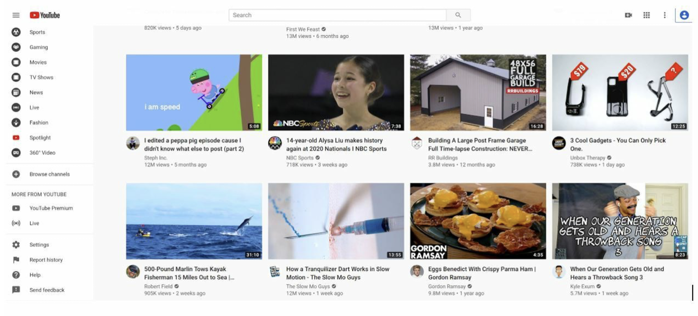

## Step 1: Establish scope
### Features
For a system design interview, it is safe to assume the features we would want to focus on are:
- Upload videos fast
- Smooth streaming
- Ability to change video quality
- Low infra cost
- High availability, scalability, reliability
- Supports mobile, web and smart TV clients

### Back of the envelope calculations
A few estimates for the product:
- The product has 5 million daily users
- Users watch 5 videos per day
- 10% of users upload 1 video per day (500,000 videos)
- Average video size is 300MB
- Total daily storage space needed: `5 million * 10% * 300MB = 150TB`
- CDN costs will be high with this amount of data.
    - The following is Amazon's CDN CloudFront costs:
    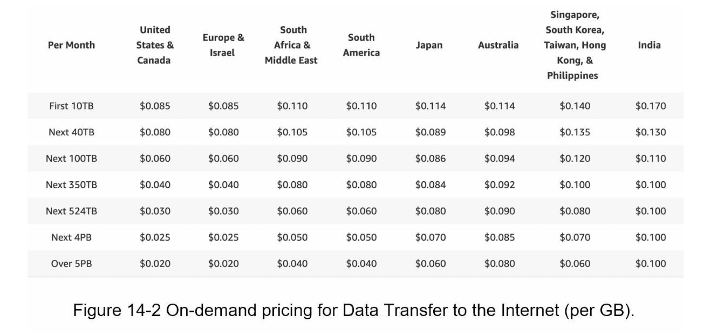
    If 100% of traffic is served from the US, with a GB served costing $0.02, the daily costs will amount to $150,000

## Step 2: Propose high-level design
CDN and blob storage will be leveraged. At a high level, the service is comprised of three components: the client, the CDN and the API servers.
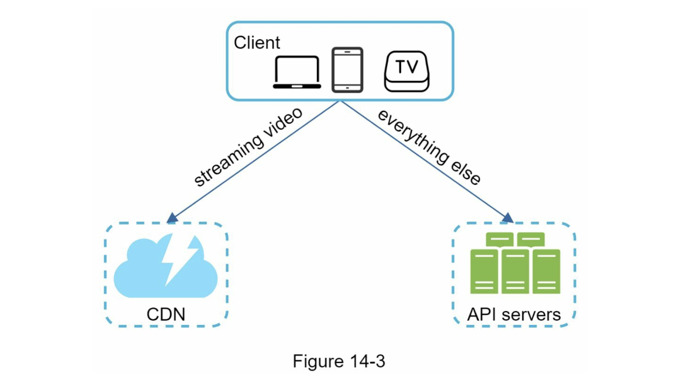

While the CDN stores videos and is the component that videos are streamed from, the API servers handle everything like feed recommendation, generating video upload URL (for BLOB storage), updating metadata database and cache (likes, followers), user signup, etc.

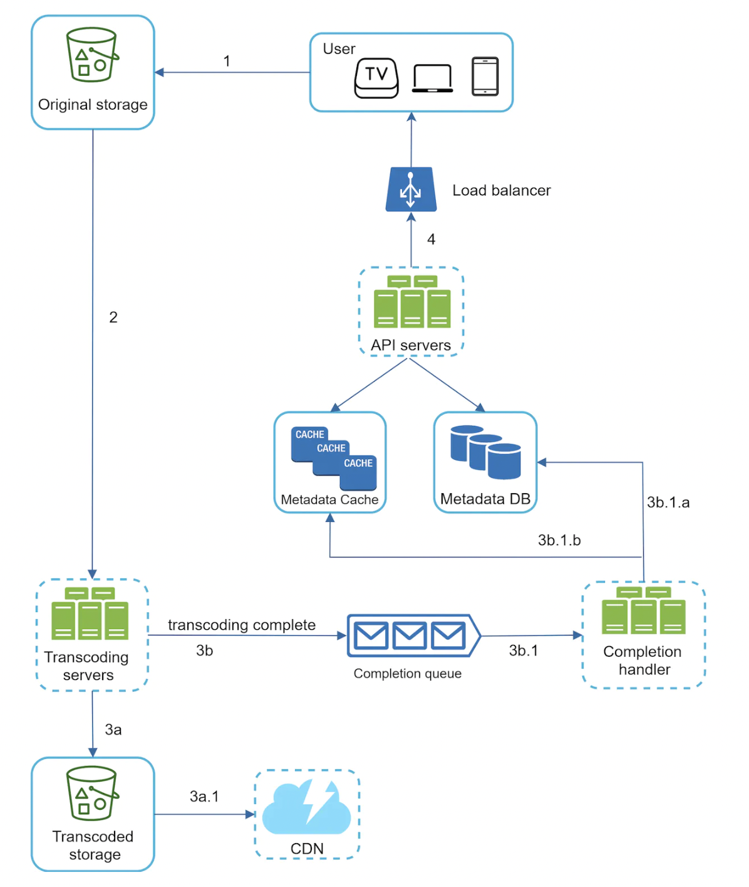

For uploading a video, we will have a flow consisting of:
- Load balancer
- API servers: all user requests go through these except for video streaming
- Metadata DB: this will be sharded and replicated to meet performance and availability requirements
- Metadata cache: video metadata and user objects are cached
- Original storage: a blob storage system for storing original videos.
- Transcoding servers: Video transcoding is also known as video encoding, which is the process of converting a video format into other formats (MPEG, HLS, etc), which provide the best video streams possible for different devices and bandwidth capabilities.
- Transcoded storage: after transcoding, video files head to this BLOB storage
- CDN: Videos are cached in the CDN; when the play button is clicked by a user they are streamed directly from here.
- Completion queue: once the transcoding is finished, a message is placed on this queue with stored information completion
- Completion handler: this consists of workers that pull event data from the completion queue and update metadata cache and database

The flow is as follows:
1. Videos are uploaded to the original storage
2. Transcoding servers fetch videos from the original storage and start transcoding (this can probably be done via triggers on an S3 bucket)
3. Once transcoding is complete, the following two steps are executed in parallel:
    3. A: Transcoded videos are sent to transcoded storage
    3. B: Transcoding completion events are queued in the completion queue
4. Transcoded video are distributed to CDN.
5. Completion handler contains a bunch of workers that continuously pull event data from the queue
6. Completion handler updates the metadata database and cache when video transcoding is complete
7. API servers inform the client that the video is successfully uploaded and is ready for streaming

While the video is being uploaded to the original storage, the client in parallel sends a request to update the video metadata. The request contains video metadata like file name, size, format, etc. API servers update the metadata cache and database.

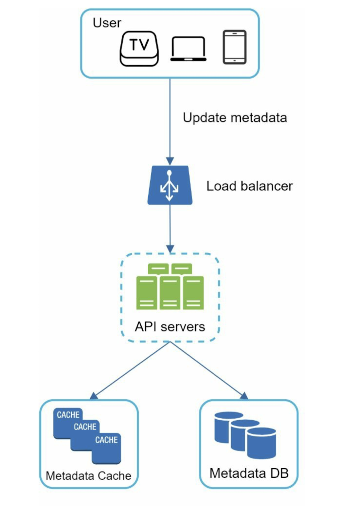

The metadata might look something like this:
```
{
    video_id: 123456
    video_title: "How to tie your shoes"
    uploader_id: userABC
    upload_URL: "{presignedURL}"  --example http://some-s3-url.s3.aws.com/some-identifier
    upload_status: ENUM(PENDING/COMPLETED)
    format: "some format"
    quality: 720p, 1080p, etc
}
```

## Video streaming flow
When someone watches a video on YouTube, they don't download the whole thing and _then_ have the ability to watch it. It will start streaming immediately and the client/device will load chunks of the video at a time so you can watch videos continuously.
There are a few streaming protocols:
* MPEG-DASH
* Apple HLS (HLS == HTTP Live Streaming)
* Microsoft Smooth Streaming
* Adobe HTTP Dynamic Streaming (HDS)

Different protocols support different video encodings and playback players. Videos are streamed from the CDN directly; the edge server closest to you will deliver the video, which reduces latency.

## Video transcoding
A host of different factors determine the optimal recording -> upload -> streaming process. Videos are recorded with the device giving the video a certain format. To play the video on other devices, the appropriate transcoding process must take place. Additionally, bitrates/processing power, internet speeds, streaming device and other factors play a role in which video format and quality is optimal.
The following factors make transcoding an important process:
* Raw video requires large storage; optimizing along this axis is key.
* Many devices/browsers only support certain video formats; correct format must be encoded for compatibility
* For smooth playback, it is optimal to deliver higher resolution videos only over faster networks and lower res videos over slower networks
* Switching video resolutions/quality manually or automatically when network speeds change is also a good idea

Different types of encoding formats are available; however, most of them contain two parts:
* Container: this is like a basket that contains the video file, audio, and metadata. The container format is determinable from the file extension such as .avi, .mov, or .mp4
* Codecs: Thes are compression and decompression algorithms that aim to reduce the video size while preserving the video quality. The most-used codecs are H.264, VP9, and HEVC

## Directed acyclic graph (DAG) model
Transcoding can be achieved efficiently with added degrees of flexibility and parallelism through a DAG.

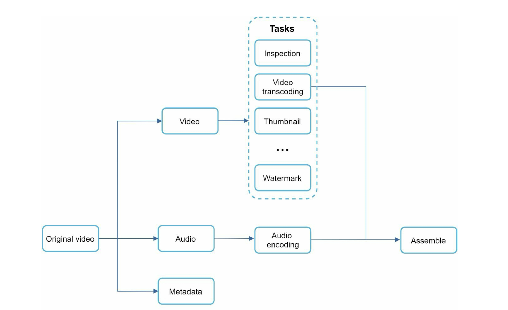

Here you can see that different tasks like inspection (making sure videos are not malformed), creating a thumbnail, creating a watermark and encoding are all supported as part of 
the transcoding process.

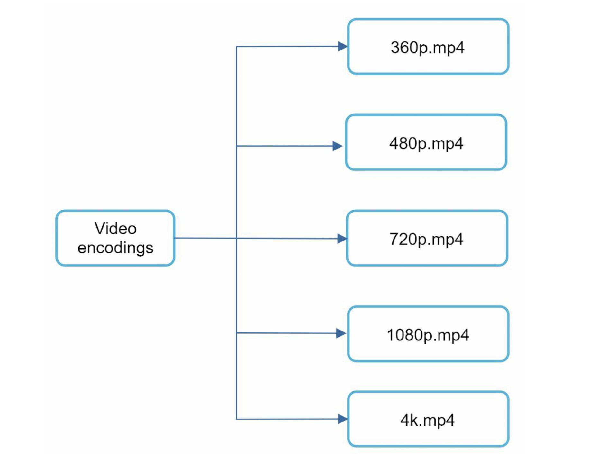

## Transcoding architecture

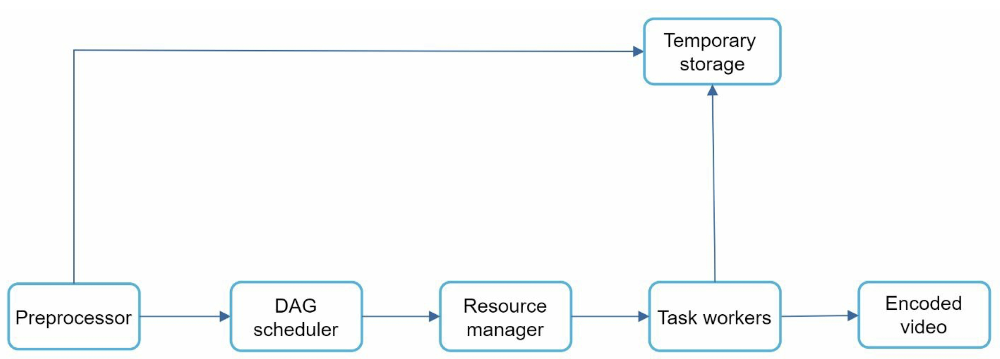

**Preprocessor**
The preprocessor does the following:
1. Video splitting - This is a process involving splitting the video into Groups of Pictures (GOP) alignment. GOP is a chunk of frames arranged in a specific order. Each chunk is usually a few seconds in length and independently playable.
2. Some old devices or browsers might not support videep splitting. The preprocessor splits videos differently
3. DAG generation. The processors generates a DAG based on configuration inputs/files
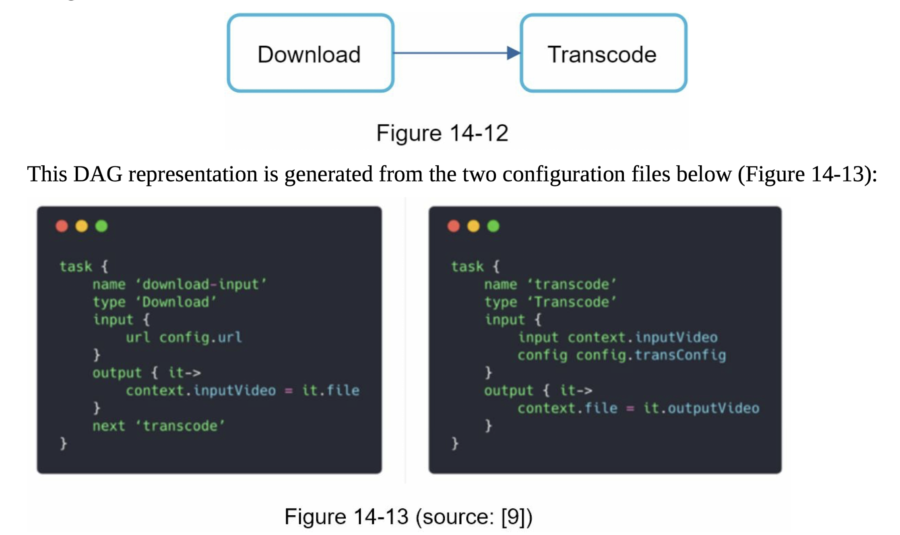
4. Cache data. The preprocessor is a cache for segmented videos. The preprocessor stores Groups of Pictures and metadata in temporary storage. If video encoding fails, the system could use persisted data for retries

**DAG Scheduler**
The DAG scheculer splits a DAG graph into stages of tasks and puts them in the task queue in the resource manager. An example would look like this:
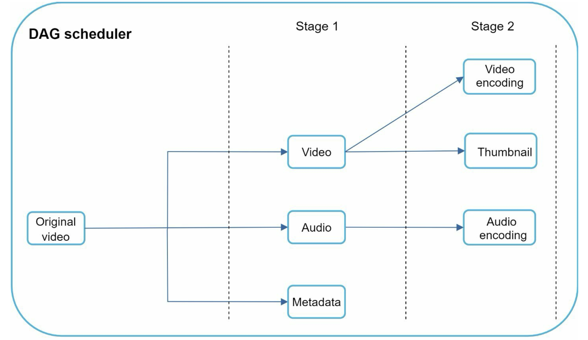
The original video transcoding task is split into three stages: video, audio, and metadata. The video task is futher split into video encoding and thumbnail generation.

**Resource manager**
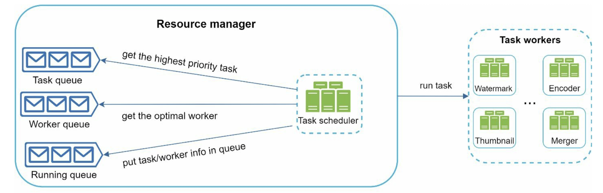

The DAG resource manager manages the effieciency of resource allocation. It contains 3 queues and a task scheduler.
- Task queue: Priority queue that contains worker utilization info
- Worker queue: priority queue that contains worker utilization info
- Running queue: contians info about the currently running tasks and workers runnign the tasks
- Task scheduler: picks up the optimal task/worker, and instructs the chosen task worker to execute the job

The coordination of everything by the resource manager looks something like:
* The task scheduler gets the highest priority task from the task queue
* The task scheduler gets the optimal task worker to run the task from the worker queue
* The task scheduler instructs the chosen taks worker to run the task
* The task scheduler binds the task/worker info and puts it in the runnign queue
* The task scheudler removes the job from the running queue once the job is done

**Task workers**
Task workers run the tasks which are defined in the DAG. Different task workers may run different tasks as shown in previous diagrams (watermark, encoder, thumbnail, merger)

**Temporary storage**
Multiple storage systems are used here. The choice of storage system depends on factors like data type, file size, access frequency, data life span, etc. For instance, metadata is frequently accessed by workers and the data size of the metadata is usually small. Therefore, caching metadata here would be a good idea. For video or audio data, BLOB storage is appropriate. Data in temporary storage is freed up once the corresponding video processing is complete.

**Encoded video**
Encoded video is the final output of this encoding pipeline. The output will look something like `funny_720p.mp4`.

## System optimizations
### Speed optimization: parallelelize video processing
Uploading a video as a whole unit is inefficient. Videos can be split into smaller chunks by GOP alignment (previously mentioned in the DAG section).


This will allow for fast resumable uploads when the previous upload failed. The job of splitting the video file by GOP can be implemented by the client to imrpove the upload speed.

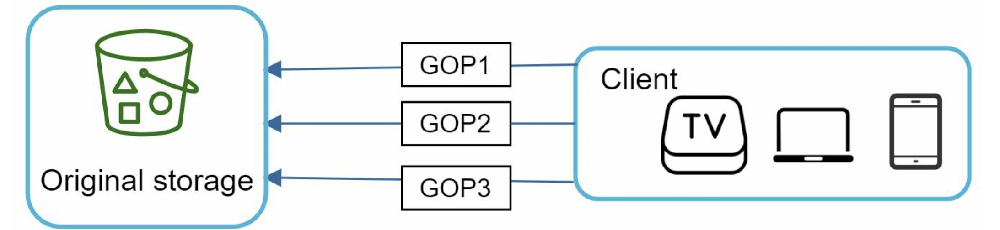

### Speed optimization: place upload centers close to users
Another way to improve the upload speed is by setting up multiple upload services in multiple availability zones across the globe (or country).

### Speed optimization: parallelism everywhere
Enabling loose coupling and designing systems with as much parallelism as possible can reduce latency. The flow for a video being transferred from original storage to CDN could be improved in this manner. The original design has steps that are dependent on the output of the previous step. Introducing messaging queues and workers can help free up resources and reduce rigidity.
Before the message queue is implemented, the encoding module must wait for the output of the download module:
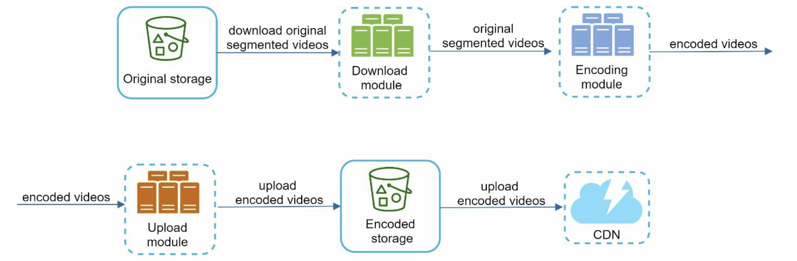

Afterwards, the encoding module does not need to wait for the output of the download module anymore. IF there are events in the message queue, the encoding module can execute those jobs in parallel.
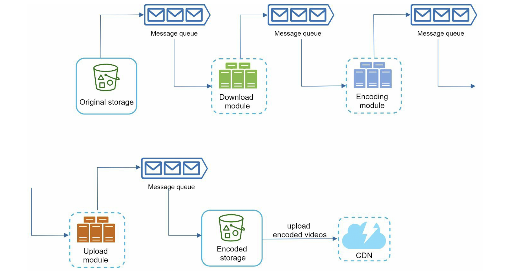

### Safety optimization: pre-signed upload URL
To ensure only authorized users upload videos to the right location, you can use pre-signed URLs.
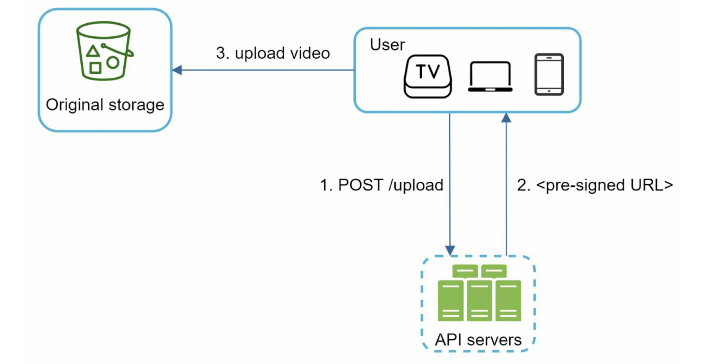

The flow is as follows:
1. The client makes an HTTP request to the API servers to fetch a pre-signed URL, which gives access permission to the object identified in the URL. The term pre-signed URL is used by Amazon S3 but other cloud services might use different names (like Microsoft Azure BLOB storage supports the same feature under the name "Shared Access Signature")
2. API servers respond with a pre-signed URL
3. Once the client receives the response, it uploads the video using the pre-signed URL

### Safety optimization: protecting videos
Several measures could be taken to reduce risk of stolen videos:
* The use of Digital Rights Management (DRM) systems: Three major DRM systems are Apple Fairlplay, Gooogle Wildvien and Microsoft PlayReady
* AES encryption: you can encrypt videos and configure an authorization policy. The encrypted video will be decrypted upon playback, meaning only authorized users can watch an encrypted vide
* Visual watermarking

### Cost-saving optimization
A CDN is crucial to a system like this, but it can rack up costs quickly. To reduce costs you can do the following:
- Only serve the most popular videos from CDN and other videos from high capacity storage video servers
- For less popular content, many encoded versions of it may not be needed. Short videos can be encoded on demand.
- Some videos are only popular in certain regions, so serving along that axis would be beneficial
- Building a custom CDN like Netflix is another possibility
Most of these options would require optimizing along things like content popularity, user access pattern, video size, etc so historical data should be kept and analyzed for that to work.


